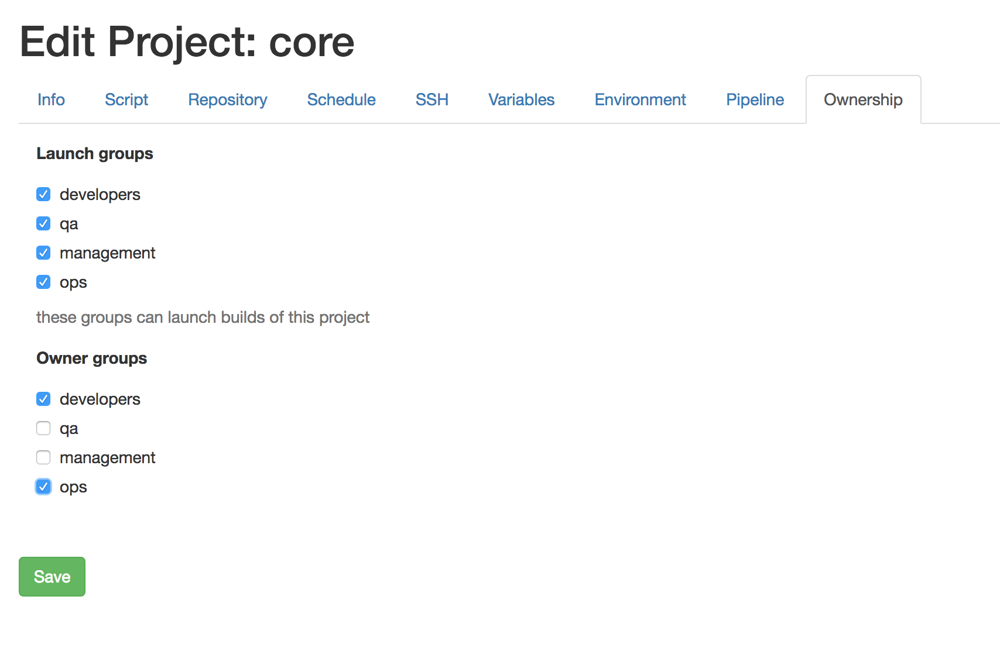

.. image:: vespene_logo.png
   :alt: Vespene Logo
   :align: right

.. _authz:

Authorization
=============

Vespene provides ways to several ways to control who can use it and how, to prevent unwanted access changes.

This authorization system is pluggable, and two plugins, called "ownership" and "groups_required" are installed by default.

The ownership plugin has no configuration parameters and includes a default policy, and the "groups_required" plugin is configurable
and can optionally further lock down those rules.

Authentication (checking usernames and passwords) must of course happen first. Nothing much in Vespene is really allowed to happen anonymously (without login), except
access to build results when fileserving is turned on (because logging in might be annoying). Fileserving can be turned off
as per :ref:`settings`.  Authentication uses standard Django methods.

Ownership
---------

The ownership plugin provides common sense access control. Rather than have a very complex policy system where it is easy to make
an error, the ownership plugin encapsulates the kinds of behaviors most users would expect to be able to control, while also making it easy to lock
down the build system rather than leaving it wide open to (potential) chaos and accidental misconfiguration.

With the ownership plugin installed, the following behavior occurs:

1.  Superusers can do everything
2.  Users who create an object can always edit or delete that object.
3.  Users can edit the 'ownership groups' of an object to extend edit/delete rights to other groups of users.
4.  Users who can edit a project can automatically run the project (aka "build the project").

There are a few exceptions. Only superusers are allowed to create and edit worker pools, because the security configurations of those are of great importance.
Also, no users can create or delete Build history objects via the interface.  There is a CLI command to remove old build records and directories that
admins can run, perhaps on cron, to clean up old records.

With the ownership plugin, it is not required to be able to edit a project to run a project. Additionally, on a project, "launch groups" can be specified in the onwership tab, granting access to start a project build or job
execution without having the ability to edit that particular project.  This works particularly well with :ref:`launch_questions` to
implement a self-service console for executing tasks.

You can tell if the plugin is enabled by looking at your settings file::

    authorization = OrderedDict(
          ownership = "vespene.plugins.authorization.ownership",
    )

Normally the plugin only limits access but does not hide objects the user does not have access to.  This can result in seeing a LOT
of projects, and some organizations may wish for a team to only see the projects they may have ownership or launch permissions for.
To enable greater filtering, the plugin configuration can be adjusted::

    authorization = OrderedDict(
          ownership = [ "vespene.plugins.authorization.ownership", dict(filter_view=True) ]
    )

The filter_view parameter is designed to make lists more compact (for example, in environments with hundreds of projects), but is not designed
to keep project configurations or user/team existance secret.  Transparency in an organization is a good thing anyway.

We expect the vast majority of all Vespene users will want to leave the ownership plugin engaged.

Groups Required
---------------

The ownership plugin provides some common sense access control, mostly at a per-object level.  Sometimes in an organization further
access restrictions on a larger scale are desirable.

The initial configuration of the groups required plugin does not impose any additional restrictions, however, it can be configured
in the settings file to limit access to certain actions on certain object types to particular groups of users.

As mentioned, the default configuration does nothing::

   PLUGIN_CONFIGURATION = dict(
       ...
       authorization = OrderedDict(
              ownership = "vespene.plugins.authorization.ownership",
              group_required = [ "vespene.plugins.authorization.group_required", {} ]
       ),
   )

Here is an example that limits the ability to create projects to a limited list of groups::

   PLUGIN_CONFIGURATION = dict(
       ...
       authorization = OrderedDict(
          ownership = "vespene.plugins.authorization.ownership",
          group_required = [ "vespene.plugins.authorization.group_required", dict(
                project = dict(
                    create = [ 'developers', 'qa', 'ops'],
                )
            )
        ]
    ),

This example gives requires users to have a login, but further requires that only Developers, QA, and Ops teams can create projects.
We do not bother restricting other types of actions here, because the ownership system will provide those levels of restrictions automatically.

The following types of object may be specified with this plugin:

- project
- build
- user
- group
- snippet
- variableset
- sshkey
- servicelogin
- workerpool

The following verbs may be specified:

- create
- list
- edit
- delete
- view
- stop
- start

If a noun or verb is not mentioned, the noun/verb combination is not restricted by this plugin.  So, by default, this plugin
imposes no restrictions.

If the value of a restriction list is "[]" (empty list), it means the action is completely forbidden by all types of users except
superusers. It would, however, be better to specify a group name, like "vespene_admins" instead.

Usage of this plugin without the ownership plugin doesn't make a lot of sense and will not result in a very secure configuration.

Also, it's easy to configure this in ways that don't match real world use cases. For instance, access can be removed to edit
a project, while leaving access to create projects, which doesn't make a lot of sense.

As previously mentioned, this imposes additional restricts beyond ownership, so being able to create or edit here does not
imply creating and editing to all types of objects, unless the user is a superuser - ownership would still be required.

Further Customizations
----------------------

Users can add more plugins if they want to.

Additional plugins subtractively stack restrictions with any loaded plugins, so if any plugin says "no" to something
that object is not included.

Plugins can both prohibit action or filter objects from view.

