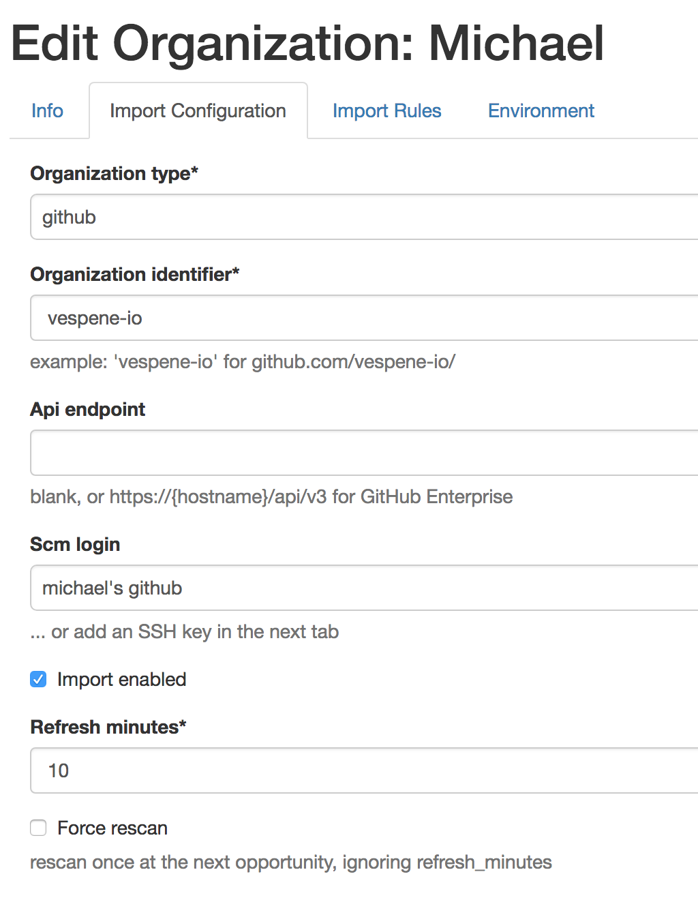

.. image:: vespene_logo.png
   :alt: Vespene Logo
   :align: right

.. _importing:

Importing Organizations
=======================

Want to make the management of your build and automation environment more self-service?  

Particularly in huge microservice configurations, it often helps if multiple teams can define their projects 
in source code and not have to go into the build system to set them up or change a build script.

With the "organizations" feature, Vespene can automatically pull in repository definitions from all of your GitHub (or in the future, other...) organizations.
You can keep your build scripts 100% in source control, but still use the full power of Vespene templating and variables and snippets within them.

Right now, this only works for GitHub organizations (including GitHub enterprise), and this feature will likely be expanded over time to support different source control vendors (such as GitLab) and more configuration flexibility.  Most of the code is generic, and small plugins deal with APIs to the particular repo indexes.

UI Configuration
----------------

Only superusers can set up organizations in Vespene.

To get started, in the user interface, add a new organization, and specify the organization identifier (the short name in the URL) and potentially the API endpoint.

Select the Service Login (username and encrypted password) combo that you will use to connect to the source control host.  This will be used to list all
of the remote repositories and collectively download the most recent tip of each repository.  When the project is built, the same login will be used
to checkout those projects.

Imports are set up to run periodically on particular workers, so you must set what machines perform this activity by choosing a worker pool.
You will also need to specify how often to refresh the organizations.  If you want to import only once, you can set the
refresh interval to 9 billion minutes or disable the organization after the first import.

Most organizations will probably want to run the import process every 60 minutes or so, but if they have a lot of repositories they
might want to go a bit slower.  Shallow checkouts are done to save bandwidth, and only the default branch is considered.

Imports are periodic. If you need to rescan your repositories you can save the organization with the "force_rescan" checkbox enabled, and the organization will be reprocessed at the next available opportunity. Once you get a working import,  you can turn off imports in the organizational control panel if you want.

When do imports happen?

Imports are processed in-between workers regular build work, so if a build is ongoing and an import is over-due, it will be handled
the next time a worker process becomes free, and before it runs another build.  This way, we make sure builds never starve the import
process, and project configurations always have a chance to keep current. 

What is imported is normally controlled with a ".vespene" file in the root of each repository. This means only projects with a ".vespene" file will be
imported - because we need a certain amount of information to be able to set those projects up.

There is a configuration option that will create a stub project without a ".vespene" file.  This is mostly useful for demo scenarios to prove the import
process "works", rather than getting a configuration fully operational. It is however a good way to show Vespene fully populated to your boss.
The imported configuration in this case won't have build script, so using ".vespene" files is preferred.

If you run an import again, changes in the .vespene file will be picked up.

The .vespene file
-----------------

A source control project in a repository signals that it wants to be processed by defining a .vespene file in the build root.

The file is in YAML format.

Here is an example::

   name: "My Awesome Project" 
   script: "go.sh"
   timeout: 6000
   container_base_image: "ubuntu" 
   repo_branch: master
   webhook_enabled: true
   variables:
      asdf: 1234
      luggage_code: '5150'
   launch_questions: []
   worker_pool: 'general'
   pipeline: 'finance'
   pipeline_definition: [ 'build', 'qa', 'release' ]
   stage: 'build'
   ownership_groups: [ 'dev', 'qa' ]
   launch_questions: [ ]
   launch_groups: [ 'support' ]

What do each of these do?

* name - defines the name of the project
* script - this file is read to become the build script.  This is a path relative to the repo root
* timeout - the build will fail if it takes longer than this many number of seconds
* container_base_image - for container isolated builds, this sets the build environment
* repo_branch - this is the repo to be checked out by default when building the project
* webhook_enabled - enables :ref:`webhooks`
* variables - see :ref:`variables`
* launch_questions - see :ref:`launch_questions`
* worker_pool - this is the worker pool that will be used to build the project
* pipeline - the name of the pipeline. Can be created if it doesn't exist depending on organization settings.
* pipeline_definition - the stages in the pipeline. Be careful that all projects sharing the pipeline use the same settings.
* stage - the stage in the pipeline where this project runs
* ownership_groups - who has permission to edit or delete the project? See :ref:`authz`
* launch_groups - who has permission to launch/build the project? See :ref:`authz`

If any value is not set, it will assume the Vespene defaults.  There are no required parameters.
The project will use the repository name if not set.

This means the ".vespene" file CAN be mostly blank.

Most defaults are Vespene defaults, though the default worker pool can be configured on the Organization object.
More import-specific defaults may be added over time.

Some cool things: Launch questions can also be defined, see :ref:`launch_questions` for the specification.
There isn't a lot of validation on this field, so make sure you get it correct by trying to launch the project
after you import it.

One gotcha: The container_base_image parameter is only used when the worker pool selected is configured to use container isolation.
Only admins can configure worker pools to do this.

Templating?
-----------

The ".vespene" files are NOT templated.  However, the script specified by the path in "script", can contain Jinja2 template data.
As per all build scripts in Vespene, it should contain a shell interpreter line, such as "#!/bin/bash".

Enforcing Limitations on Change
--------------------------------

In the Vespene UI, it is possible to limit whether projects are allowed to rename themselves, whether they can overwrite the build
script once loaded into Vespene, and whether they can overwrite other configuration parameters.  In most cases, you can leave
all of these controls ON if you trust developers. The most dangerous setting is perhaps "allow_pipeline_definition", which can be
used to create pipelines if they do not exist, or reorder or reassign their stages, as this could effect the build cycles
of other projects.

If you are supremely concerned about those with access to source control making unwanted changes, you can choose to not set up
organizations in Vespene, or use them once and then delete the organization.

Errors
------

Every import will produce a "Build" object in Vespene.  You can look at builds to see a log of all of the import history.
The Build itself will be marked "failure" if there are any errors at all to address, but will keep scanning to do as much
as it can.  Just because one team makes an accidental error in a .vespene file does not mean the other teams should have to wait to
get their changes applied.

