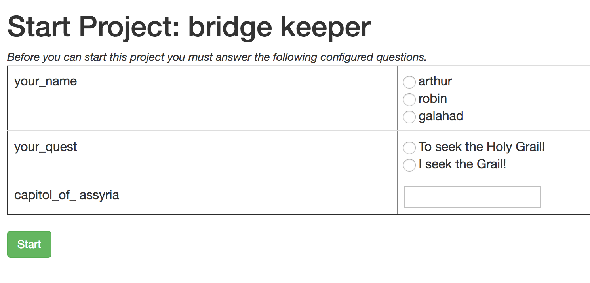

.. image:: vespene_logo.png
   :alt: Vespene Logo
   :align: right

.. _launch_questions:

****************
Launch Questions
****************

Imagine if you want to have a project launch button that asks the user some questions, and then based on those
answers, runs appropriately based on those answers. 

This is exactly what launch questions do.

For instance, a generic deployment script could be written that prompts an ops engineer for the release tag, and can deploy any tag they
type in. 

Similarly, a generic setup script for a new employee could ask for their username, and then provision lots of cloud resources for that user
to create private development or test environments.

Or also maybe imagine a project that reboots a region, or backs up a database, or anything.

You could put very complex automation in the hands of someone who shoudn't (neccessarily) need to know how it works, and make it relatively
fool-proof to run.

Launch questions do just that.

Setup
=====

Launch questions can be configured on either a project under the "Variables" tab.

The field takes JSON in list format, using a list of variable names and specifiers, as follows::

    [
    { "variable": "foo", "type": "multi", "choices" : [ "a", "b", "c" ] },
    { "variable": "bar", "type": "radio", "choices" : [ "d", "e", "f" ] },
    { "variable": "baz", "type": "text" }
    ]

At this point, the validation on the question configuration is somewhat limited, so the best way to test the launch questions is by trying to 
start the project.

The Question Format
===================

Launch questions are specified by a JSON list of "question specifiers".

Each question must have a type, or else it will assume to just use a "text" box, which is the default.

The other two types at this time (more types may come later) are "radio" and "multi".  
Radio means to pick one item from a list, and multi allows picking more
than one. 

The variable name here controls what variable name is to be provided to the templates, and the "prompt" controls
what should be shown on the screen, as described below in "Usage"

At this time there isn't much validation performed on the input values, but we're open to improvements.
See :ref:`resources` and :ref:`development_guide` if you have ideas.

Usage
=====

When starting a project that has launch questions attached, instead of directly starting
the project, a form will appear with the questions listed in order.

Then, once started, the script for the given project (or all projects, if using a pipeline) can then
access template variables::

    #!/bin/bash
    ./step_one --foo="{{ foo }}" --bar="{{ bar }}"
    ./step_two --baz="{{ baz }}"
  
As with standard builds, all of the variables made available to you are also available in 'vespene.json' in the
build root, which is the current working directory of the build - so this is an easy way to pass it to
any programming tool that can read JSON, or even YAML, because YAML is a subset of JSON. Many popular automation
programs can read in variables this way.

Limitations
===========

When a project has launch questions attached, they are *NOT* prompted for when started by clicking on the
pipeline, or if triggered by a webhook.  The project will still run, the variables just won't be set.

If you didn't define a default value for the variable elsewhere (like in the variables page
for the project), this could result in a template error, which you can see in the build output.  

You could also code the Jinja2 template that is using the variable somewhat defensively to check to see if the
value is set. There is also the Jinja2 filter called "| default".  Refer to the Jinja2 documentation for
more info.

