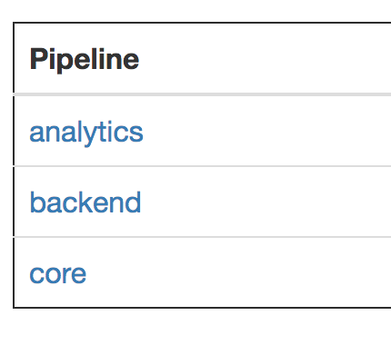
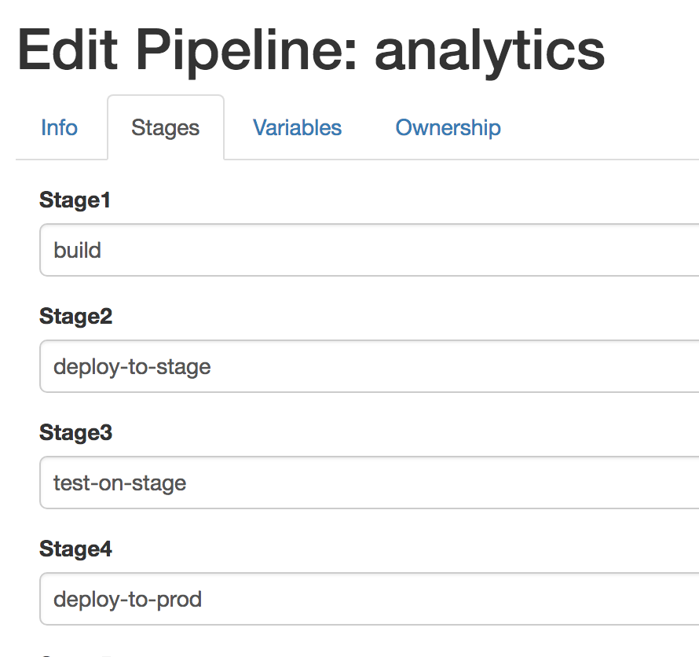

.. image:: vespene_logo.png
   :alt: Vespene Logo
   :align: right

.. _pipelines:

Pipelines
=========

Pipelines are a method of triggering one or more jobs, in stages, when other jobs complete.  A build system is already a "continuous integration" system, so pipelines extend it to become the hub of
a "continuous deployment" system.

Vespene pipelines are configured graphically, without any special language or data format.

Builds in a pipeline can intelligently pass variables between one another using :ref:`output_variables`.

Stages
------

To use pipelines, each project must be assigned to a build "stage".

A build stage is simply a named step in a pipeline.

As an example scenario, a Vespene admin such as yourself may create the following stages:

   * Build
   * Test
   * Stage
   * Deploy

"Stage" is an unfortunately confusing for a name of a stage.  In the industry, we often mean "Stage" to refer to a staging environment that
simulates production as "stage".  When we say "Vespene stage" here, we mean a pipeline *step*, like each stage of a rocket seperation.

Ok, so, if you ran the "tutorial_setup" command mentioned in the :ref:`tutorial`, you already have
some stage names set up.  If not, you'll need to make some by going into the Stage tab as a superuser and adding some.

Pipeline Objects
----------------

Once that the stages are defined, you can click on "Pipelines" at the top of the Vespene UI and start
defining a pipeline.

Vespene also shows the list of all the current pipelines that may exist.

In our CI/CD example, we would normally create one pipeline for each type of service we have.  For instance,
we might have a "Analytics" pipeline and a "Finance" pipeline.  Thus pipeline names are most frequently
going to be named after service names.

If you have a giant ton of microservices, this might be a lot of pipelines. Sorry about that!
We might make some way to automate that setup later.

Pipelines can have up to seven stages, each executed in order.

Here's an example stage configuration:

If you have a bunch of pipelines with the same configuration, don't be confused.  We assign projects to each step of the pipeline
inside the project tab. We'll do that next.

Configuring Projects
--------------------

Once the Pipeline and Stages are set up, we have to add each project to the pipeline.

In doing so, we go into the Project definition and assign it to both a pipeline and a stage.

For instance, for a "finance-backend-code" project, that would likely get assigned to the "finance" pipeline and the "build" stage.

Triggering the Pipeline
-----------------------

No special action is required to trigger a pipeline.  When all builds in pipeline are completed and successful, all the builds
in the next stage of the pipeline automatically trigger.

If any of the pipeline stages have failed, the next items in the step will not run.

Builds can be triggered with the play button beside the project name or with :ref:`webhooks`.

Communicating Between Builds
----------------------------

You can use :ref:`output_variables` to read in variables set by previous stages of the pipeline, as well
as write variables into the next stage. Review the variables documentation thoroughly to see what all is possible.

Interaction with Launch Questions
---------------------------------

Pipelines are designed for automated use - as such, any :ref:`launch_questions` are currently ignored when triggered by pipelines.

There is one case where you might care about them though.

Suppose you have a "build_app" and a "deploy_app" project, in different stages of the same pipeline.

Say that normally, build_app uses :ref:`output_variables` to pass the image ID it creates to a generic project named 'deploy_app'.

If you want to run the deploy step without retriggering the build step, you could assign some launch questions to the deploy_app project, asking
for the same variable_name that normally comes from the output variable.

When run manually, the "deploy_app" project would ask for the questions to be answered that it would normally get from the pipeline :ref:`output_variables`.
Use the same names, and the project can work either triggered form the pipeline or manually!

Handling Failures
-----------------

Suppose one of the intermediate builds of a pipeline fails and then the error is fixed.  Does the whole pipeline have to be
restarted?

It does not.  Start the build in question and the rest of the pipeline can finish as normal.  If you do not want
to retrigger that particular build and DO want to run the entire pipeline, simply kick the project that is part of the first
stage instead.

Opting Out
----------

To temporarily run a project without triggering the whole pipeline, it is not required to remove the project from the pipeline.
Simply disable the pipeline in the configuration of that project.

The whole pipeline can also be disabled directly.
