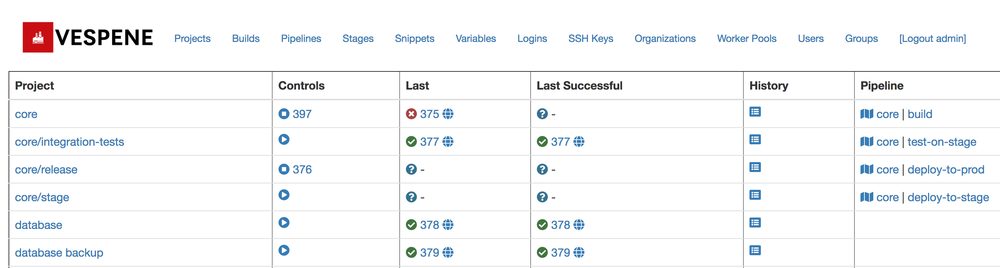

.. image:: vespene_logo.png
   :alt: Vespene Logo
   :align: right

.. _projects:

Projects
========

Projects are the cornerstone of all work in Vespene.

A project in Vespene represents a source code repo with an associated build script, or maybe just a script without a source code repo at all.
It could represent a push-button provisioning process just as well as building code.

When you login to Vespene, the first view that comes up is a list of projects.

Starting and Stopping
---------------------

In the list view for a project, you can see the standard play/stop icons for starting and stopping a project build.

Builds can also be started by :ref:`webhooks` - see that section for setup notes.

Each project also maintains a list of build history.  Cleaning up that  history is described in :ref:`cli`.

If you click on the edit button by a project there are many settings to configure.

Creating A Project
------------------

A Project takes lots of parameters, and we'll cover some of those feature explanations in later chapters.

Most importantly, a project needs a build script.

The script *must* start with an interpreter line like "#!/bin/bash", so Vespene knows what to run.  Otherwise any script can
go in the script box.

A project also needs a worker pool.  This specifies what machines can run the particular build or script. 

Only superusers can create worker  pools, and this is because they also require a running process to serve them. If no worker pools exist in Vespene, it will be impossible to create a project until one is created.  Workers are not
launched automatically, so admins will need to pay attention to :ref:`setup` and :ref:`workers` for more information on worker pool configuration.

The script itself can use :ref:`variables` to simplify these scripts and reduce duplication between
projects.

In addition to the configuration of a repository address, Service Logins and SSH Keys (see :ref:`access`) can be attached to the repo to allow the project to access SCMs like GitHub or manage infrastructure using those keys. SSH key management is handled automatically by the workers using ssh-agent.

The project can also be made a part of a continuous deployment pipeline.  See :ref:`pipelines`.

