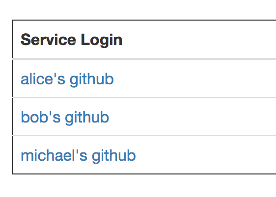

.. image:: vespene_logo.png
   :alt: Vespene Logo
   :align: right

.. _setup:

*****
Setup
*****

Thanks for the interest in setting up Vespene!  

To start, Vespene is a Python-based application.

At a technical level, it is implemented using the Django web-framework on the frontend, and supervisord and custom
python daemons (which also use Django code without the webserver) on the backend.  Both layers share a PostgreSQL database.
You will not need to know anything about Django to run the application, but if you do know Django, the following instructions
should be a bit familiar to you.

If you don't know Django, the provided shell scripts will automate nearly everything, and we'll explain them as we go.  Setup 
is supposed to be pretty easy - we've grown to dislike tools that take a long time to install, learn, and understand. 

Some of your choices will come down to how you configure the plugins, but largely most Vespene installs should feel like any other
Vespene install.  That's very important to us. 

We also follow a "batteries included" approach to plugins, so as plugins are developed, 
you won't have to hunt for what plugins work and don't work, and their particular needs and requirements. If you find the Vespene install
instructions confusing or incomplete, please open a ticket on GitHub - it's important to us that we make this go as smoothly as we possibly can, and suggestions
to make this more understandable are very welcome.

Ready to start trying out Vespene?

You are encouraged to read the scripts before you run them (please do!), as they are very simple and short, and include
some comments.  As you read them, you'll understand more about Vespene's architecture and files are important to it.

Vespene likes to put files in the following places::

    /opt/vespene
    /etc/vespene
    /etc/vespene/settings.d
    /var/log/vespene
    /var/spool/vespene
    /tmp/vespene/
  
If you like, you can skip our setup scripts and configure everything by hand (once you see what they do), or adapt them to use your favorite install automation - that is your choice. However, for the first time, we recommend trying the setup scripts.

Is My Platform Supported?
-------------------------

Whether or not setup scripts are provided in the project, Vespene aims to be compatible with all Linux or Unix distributions.
Where your favorite distros are not supported yet we absolutely take patches to add them.

The only thing we clearly don't support yet is Windows. Windows worker support and automation will come in the near future. 
If you are interested in working on Windows support, please let us know!

For this first release, the "setup/" directory of a checkout includes setup scripts for CentOS7 and the latest Ubuntu LTS, which
was "Bionic Beaver" at the time of writing this.

Once you have the app running in production mode, you may wish to know how to work on it as a developer.
For development setup instructions, see :ref:`development_setup`, which includes OS X development tips.
Michael does a LOT of his development for Vespene on OS X and everything also works fine there.

Where To Run What
-----------------

The simplest possible Vespene installation uses one machine, running the web application, one or more worker processes, and the database.
This is what you should start with as you explore Vespene for the first time.

The configuration for a larger installation is exactly the same - just run the same steps everywhere, possibly only changing
the worker configuration from box to box - you can run multiple web nodes and multiple worker boxes, without any special effort. 
You of course will also only install one databse, and then configure the workers to connect to that database using the python settings files.

The workers communicate through a common database using lightweight database polling to 
avoid an extra message bus dependency (for now, anyway), so as long as they have the same database configuration, life is good.
This means there isn't an extra message bus or leader election system to keep up with.

You would run the setup scripts on *each* node in the soon-to-be Vespene cluster.

Preparations
------------

We'll start by checking out Vespene into a temporary directory::

	git clone https://github.com/vespene/vespene.git ./vespene
	cd ./setup/<your-operating-system>

If your Linux/Unix operating system isn't in the list of example installation scripts,  you can
probably read the setup scripts and adapt instructions accordingly without too much
trouble.

Common Settings
---------------

We need to adjust some settings. If you read through 0_common.sh there are explanations of a lot of choices to make, which
result in configurations (ultimately) in /etc/vespene. If you ignore most of this file, be positive you pick a unique
database password and don't just use the default, but the other settings are pretty good
starting choices::

	# vim 0_common.sh

Note the database address you chose in this file. If you plan to use an external database, 
name that hostname now, and keep that in mind when you get to the database setup step a bit later on. 
Otherwise, you'll install it as part of this setup process. You could also choose to use an external databse,
such as PostgreSQL on Amazon RDS.

It is important to be aware that this configuration you are editing now is just for the install automation, normally Vespene configuration
lives in /etc/vespene. These setup scripts will be configuring some settings in /etc/vespene
with your choices.  There are some defaults that ship with the application (like :ref:`plugins`) that are completely skipped by this
setup process, and you'll want to read up on those later once you have things working. You'll get Vespene with a minimal plugin
configuration that should work for leaning the tool, but that you might want to customize later.

Unless you wish to re-run these scripts, you won't be editing this setup script again.

Software Dependency Setup
-------------------------

It's time to install some dependencies.

This step will install python 3 (if needed) and then install python dependencies.

Once installed, Vespene will reside in /opt/vespene and settings will be in /etc/vespene/.

Run the requirements setup script as follows::

	# bash 1_prepare.sh

If you are not root, you'll need to run these with sudo.

Database Setup
--------------

We've mentioned this already when talking about settings, but decide where you want to run the Vespene database.  

In the simplest possible configuration where you have only one machine running Vespene to start, installing
a database on this server is quite reasonable.

To run the script to install the database::

	# bash 2_database.sh

If you are intending to deploy a multi-node environment, setup is on your own, just
make a database available at the server address and username/password you selected in "Step 0".

Application Setup
-----------------

This next step will configure the application to point at the Vespene database and 
run any database migrations that may be required during an upgrade::

	# bash 3_application.sh

This step will have generated some secrets in /etc/vespene/settings.d/secrets.py. IMPORTANT: If you are performing
a multi-site install, you will need to copy this file to all machines in the Vespene cluster *prior*
to starting those nodes in step 6. In particular, secrets in this file are used to encrypt some data in
the database and protect the Django installation against some hijinks. If these files are not consistent across
the cluster, decoding of secrets (like logins and SSH keys) won't work correctly. This is further explained in :ref:`security`.

Superuser
---------

Once and only once per cluster, you need to run the superuser configuration step::

	# bash 4_superuser.sh

This will interactively prompt you for a username and password for the superuser account.  This is the
account you will use to to login to Vespene for the very first time, so remember what password you
chose.

Creating Tutorial Objects
-------------------------

This step is optional.

Vespene is now mostly installed, but if you were to log in, there's not a lot configured.  We find that
initially seeing a blank screen might not give users the best initial experience, so the next command
will create some basic objects for learning Vespene::

	# bash 5_tutorial.sh

.. _supervisor:

Service Configuration
---------------------

The final step will configure the Vespene service to start automatically on boot, using
a systemd unit file that starts a series of supervisor processes configured in /etc/vespene/supervisord.conf.

You will automatically get a copy of the webserver and also any worker processes configured in 0_common.sh
will also be added to the supervisor config.

	# bash 6_services.sh

If you ever want to change how many worker processes run on each node (and which ones), you
can just edit the common configuration and rerun this step on that particular node::

	# vi 0_common.sh
	# bash 6_services.sh

You could of course also edit the supervisor config directly in /etc/supervisord and then restart the
"vespene.service" systemd service.

Once started, Vespene will serve the UI on port 8000, which should be enough for most
production deployments. You could choose to proxy it with NGinx or Apache if you wanted, for instance
to add an SSL cert.

You can also choose to use something other than supervisor to run the worker processes if you wish.
Nothing in Vespene itself checks for these to be managed by supervisor, so if you start them some other
way, that is acceptable.

One minor gotcha is we didn't know in advance if you wanted to install the database server on the
same box as the Vespene services, so the Vespene services don't normally have a startup dependency on the
database.  You can add this by editing the systemd unit file.

If the service is not operational on reboot because PostgreSQL was not ready, just restart "vespene.service".

Developers can learn about starting workers and the web process in :ref:`development_setup` and many systems
administrators will also benefit from understanding this as well. In short, supervisord runs and watches over
commands that are not far off from the development testing commands, and all systemd really does is launch supervisord.

Testing
-------

Visit your webserver on "/" (port 8000) to see if everything is operational.

Once ready, you can hop on over to the :ref:`tutorial`.

Configuration Updates
---------------------

As a reminder, all configuration resides in /etc/vespene/settings.d

After making any changes there, you will need to bounce the service::

    systemctl restart vespene.service

Logs
----

Should you wish to study them, logs are all sent to /var/log/vespene/

Using Configuration Management Systems
--------------------------------------

If you would like to create Vespene content for your automation system rather than using these scripts, that's fine.
You should probably still take a look at these scripts for reference.

The nice thing about doing them in bash was that it's easy for someone to understand regardless of what automation
system they know.

Upgrades & Maintaince
---------------------

You don't have to do it now, but you should probably read :ref:`upgrades` and :ref:`cli` (for cleanup commands) before you get too far along.
They talks about the update step for database migrations, backups, and managing clutter from build artifacts. In all, there's not a lot of associated
maintaince activity to worry about.

Thanks for trying out Vespene and have fun!

