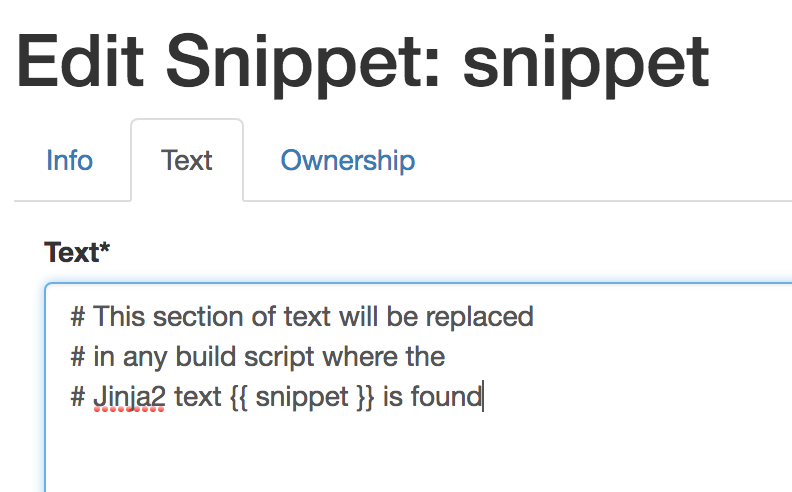

.. image:: vespene_logo.png
   :alt: Vespene Logo
   :align: right

.. _variables:

*********
Variables
*********

A major challenge to large organizations is enforcing commonality in build scripts.  To do this, Vespene
allows the build script to be templated, using various variables set throughout the program.

This allows reuse in large build systems where standards between build scripts, or common settings, sometimes
drift and are hard to make consistent.

Vespene also allows simple text substitution but also substitution of larger blocks of text, which Vespene
calls "Snippets". Snippets are first-class objects in Vespene, and variables can either be defined directly on an object
(like a stage or project) or attached to "Variable Sets" which are like buckets of variables that can
be easily "sucked in" to be reused between different objects.

Explore the Vespene UI and you will encounter places to enter variables, variable sets, and also snippets.  Snippets
are always top level under the "Snippets" heading, but variables and variables sets can be attached to many object types.

.. basic_variables:

Basic Variables
---------------

What we are calling "basic" variables are variables that are assigned directly on an object, like a project, in JSON format.
These variables aren't shared or reusable with other projects but are an easy way to avoid repeating certain constants throughout
a build script.

.. _variable_sets:

Variable Sets
-------------

Variable sets are reusable groups of variables that can be assigned to any object, and in fact multiple different objects.

For instance, imagine in a basic example an IT team defines the URLs for various important service endpoints.

Any project that wanted access to these definitions could simply choose to attach the variable set that the IT team created.

It is basically a way to import some variables without having to duplicate their values multiple times.

.. _templates:

Templates
---------

In a build script, you can access any variables using Jinja2 syntax, like so::

   some_script.sh --option={{ variable_name }}

A great deal of Jinja2 syntax is available, see the Jinja2 website for details.  In short, you can do things like this::

   
      sh go.sh --install-unilaterial-phase-detractors --hydrocoptic-marvelzanes={{ marvelzane_count }}
   

There are also loops.  

.. _snippets:

Snippets
--------

Snippets in Vespene are variables whose values are chunks of text that are themselves also templates.

These are created as top level objects, so it's easy for one group to maintain a component of a build
instruction used by multiple other groups.

Sippets are loaded in a build script in exactly the same way as variables.  In the following example, a build script
pulls in two snippets named "common_setup" and "security_scan"::

   {{ common_setup }}
   my_build.sh
   {{ do_security_scan }}

Jinja2 also supports a lot of logic, like if statements, which can also be used.

The snippet can also make use of evaluating variables and Jinja2 logic, including the Jinja2 set statement.
For instance::

   {% set s3_bucket = "blippy" }
   {{ s3_push }}

.. _vespene_json:

Accessing Variables From The Build Environment
----------------------------------------------

Bonus feature! The variables are also made available in the build root in a file called "vespene.json".

It is worth noting that YAML systems can load JSON files automatically too, so if you have a tool
that consumes YAML this is an easy way to inject Vespene parameters into that tool. Can you think of
one?

.. _output_variables:

Output Variables
----------------

:ref:`pipelines` often need to pass variables from one stage into other stages.

In the build output, simply write the following to standard output on a blank line::

    vespene/set variable_name variable_value

The variable name must be a valid Python identifier.

Be sure to *not* include an equals sign. Longer values can be included in single or double quotes::
    
    vespene/set some_value "this value has spaces"

This variable will be made available to all future pipelines in later stages of the pipeline build.

Precedence
----------

Where should you put variables if you want to know how to override them?

It is best to try to just define variables in one place.  But in some use cases you may want
to set a global default setting and then have a team override it.

The precedence order is noted below. In event of variables set in more than one place, the variables listed LAST in this list will have highest precedence:

* Any variables or variable sets set on the :ref:`worker_pools` object.
* Any variables or variable sets set on the :ref:`pipelines` object.
* The names of any :ref:`snippets`
* Variables loaded from a prior stage in a pipeline
* Variables assigned directly on the project

Many objects allow pulling in variables from variable sets or just setting them directly by attaching some JSON. If a variable is defined in both loose variables and variable sets at the same "level", the loose variables
override the variable sets.

Also note, in the event a variable has a value of a dictionary, the variables inside are *not* merged, but the new variable will stomp over the old one.

Again, this sounds complicated as there are many places to put variables, but it's easiest if
you just think of the places variables should go:

* Site specific variables should be set on a variable set, named something like "Site Defaults" and attached to each project
* Environmental specific variables (like common server addresses or s3 bucket names) should be set on a stage object. These are useful even if :ref:`pipelines` happen to be unused or disabled.
* Build results should be communicated through output variables when in a pipeline
* Etc.

The whole variable precedence system is pluggable, so you can rearrange the rules or even add new
variable plugins to pull in variables from external sources.  However, if you do rearrange the policy, let us know when filing any tickets or talking about it, otherwise we'll assume
your configuration is set up stock like everyone elses.

We hope you enjoy organizing your builds with the variable subsystem.

