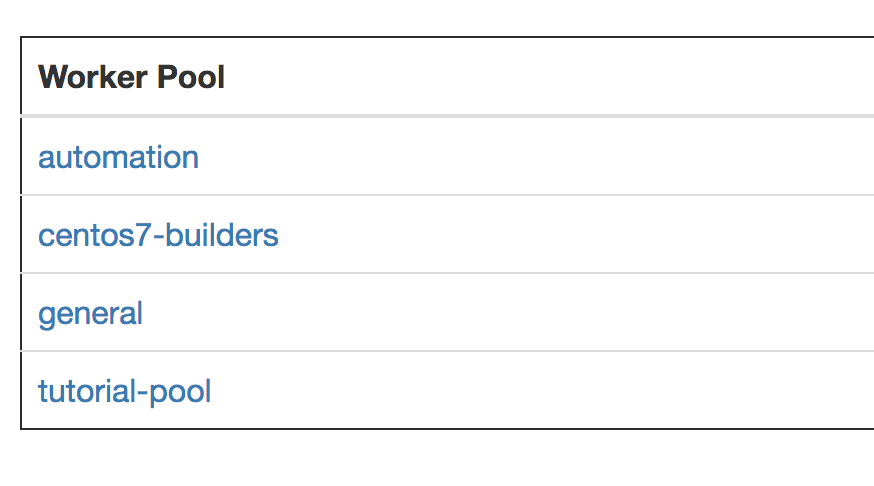
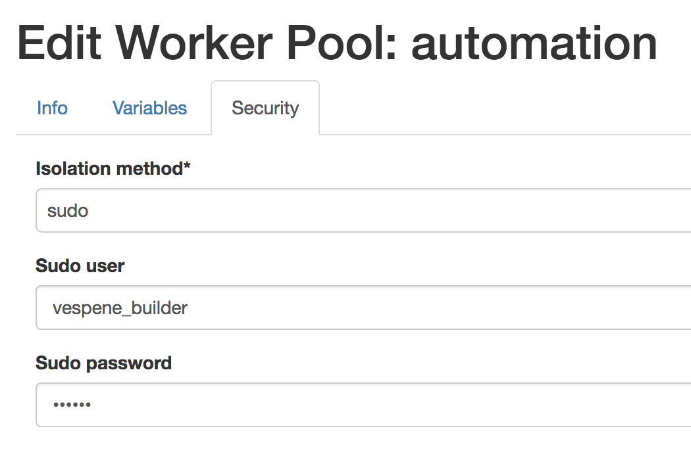

.. image:: vespene_logo.png
   :alt: Vespene Logo
   :align: right

.. _worker:

.. _workers:

*******
Workers
*******

This page goes into more detail about what happens when a build runs, and a bit more about the strategy of managing worker processes in Vespene.

As a refresher, Vespene is a horizontally scalable application.  Every node runs a copy of the web interface, and can run one or more worker processes.

Setup and configuration of workers is also described in :ref:`setup`.

How Builds Work
---------------

Workers in Vespene run scripts that are set on :ref:`projects`. Any project can be triggered manually, or by change from a webook (see :ref:`webhooks`).
When a project is triggered, a build object is created in the QUEUED state, which is picked up by a worker
serving the named "Worker Pool" assigned to that project. 

If, for example, a project is set to use the "general" worker pool, only workers farming the "general"
queue can pick up builds for that project.  Similarly, if the project is set to use the "AmazonLinux"
worker pool, only workers farming the "AmazonLinux" queue will pick up those builds. Thus the "Worker Pool"
setting on each project is very important.

If you are just using Vespene to build software, you can think of workers as "builders" - but they might also run
arbitrary automation scripts of any kind. Generally speaking, they do "work".

If you ran the tutorial, the "tutorial_setup" command already created one worker pool. You can delete it if you are no longer
using it.

Just creating a worker pool doesn't allocate any workers to a pool.  This happens when a worker starts up, on the command line the worker says
"I am going to serve this queue", and then it starts looking for work on that queue. We'll get into that in a bit.

Once a build is dequeued by a worker, the system will check out any configured repository into a working directory (if so configured) and then run the results of the script
as templated through the :ref:`variables` system.

Platform Support
----------------

It is important to note that the builders have been developed for OS X, *BSD, and Linux operating systems, and have not been tested on windows at this
point. We openly welcome community contributions for windows builder support.  This will probably require some *very minor*
changes to add a new isolation mode, which is discussed below. Let's talk about this on the forum!

.. _worker_pools:

Worker Pools
------------

Ok, so we've gone over that Worker Pools are named queues that run builds assigned to them, and have one or more worker processes (see :ref:`setup`) farming work off the queue for them.

Worker pools will most commonly be named by operating system.

Configuration of the worker includes security settings:

As mentioned in :ref:`development_setup` the worker is launched as follows:

    ssh-agent python manage.py worker <worker-pool-name>

If following the :ref:`setup` instructions, setup will create a supervisord configuration in /etc/vespene that will automatically launch several worker processes for you,
and this supervisor configuration itself will be launched by the operating system init system (for instance, systemd on CentOS 7).

The process does not daemonize and logs to standard output.

Any number of worker processes may be run on any machine - so if you
want 5 worker processes, then start 5 worker processes.  You could easily start 5 workers for one type of queue and 3 for another type of queue, all on the same
machine.

You can start multiple workers on different machines too, they should use the same codebase and have the same
settings.py.  The :ref:`setup` process talks about this.

The Build Flow
--------------

So, let's talk about the build process some more, in greater depth.

When a worker decides to "claim" a build, it moves that build from QUEUED into RUNNING state.

First, the build system will run any configured :ref:`triggers` which will prepare for the start of
the build, such as sending a chat announcement or running some configured shell commands. Triggers are plugins,
they can do anything, but they do run from the worker machines.

A working directory is then prepared using the build root configured in settings.py, named after the build number.

The worker will then add any :ref:`ssh` keys associated with the project before running the build.

The worker will then perform any source control checkouts using any :ref:`service_logins` or :ref:`ssh` keys,
but not all build scripts are required to have a repo associated with them.  They could just run a simple script
without a checkout (if the project SCM type is set to "none").

Then, after checkout (if needed), the worker will attempt to isolate the build script.  At this point in Vespene's development, there are two
isolation modes, described in the next section. You can also read a little more about security and why isolation is important
in :ref:`security`.

The build script at this point has already been templated (see :ref:`templates`), so the build script
then kicks off the build.

As the build runs, the build output is continually updated.

While the build runs, output is stored back in the database.  If a build stop was requested, the worker will pick up on that and terminate
it at the next available opportunity.  Builds can also be terminated for taking too long to run, which is also configurable on a per project
basis.

Finally, the build status and end time are recorded and we are ready to run triggers that announce the
end of the build process.

These :ref:`triggers` may also be in charge of publishing the build contents.

.. _fileserving:

Fileserving
-----------

It's great to run a build, but what do you do with the output?  How do you see what happened and get your files?

Buildroots can be shared with users of Vespene in one of two ways.

First, a trigger (see :ref:`triggers`) could be configured to copy a build root to a public location, for instance, a HTTP+NFS server, s3, or so on.
If doing this,  configure BUILD_WEBROOT_LINK in :ref:`settings` and a link to this location will appear in the user interface, pointing
to each build.  The link will be a globe icon.  This is a very high-performant way to serve results and will keep all your files - from all the different
workers, in one place.  It requires a bit more setup, but it's easy to do.

Alternately, each Vespene worker can serve up their own builds using their own web server. To do this, configure the :ref:`settings` on each worker
to leave FILESERVING_ENABLED on. Vespene workers will automatically register
their ports and hostnames each time a build is run. If the hostname that comes up in auto-registration is not correct (hostname detection can be weird!), 
you can explicitly set the FILESERVING_HOSTNAME and FILESERVING_PORT in settings. Then, when you click on the globe icon for each server, you will be
taken to the worker machine that hosts those files, and that worker will serve those files up to you.

For larger setups with lots of users, we eventually recommend switching to the first method.

.. _isolation:

Isolation Modes
---------------

This has been mentioned in a few other places.

Builds can be isolated from each other in one of two ways.  More isolation types will be added over time.

.. _sudo_isolation:

Sudo Isolation
==============

The first mode, sudo, switches to a sudo user before running the build script.  This mode comes with few dependencies and is easy
to set up. On the worker pool, the sudo_user must be configured, and this user as described in :ref:`security` must NOT
have access to read the Vespene configuration files.

.. _container_isolation:

Basic Container Isolation
=========================

The second mode is "basic_container" and conducts the build in the context of a "docker build" execution, with the build script
run in a subdirectory of a squeaky clean docker image.  You can define the base image to use for the build on a project-by-project
basis. One downside to this isolation mode is that SSH keys are not made available to the docker process *after* the checkout, so if you
are running cloud commands that need SSH keys (for instance), it's better to leave those builds using a worker pool that uses
the sudo isolation mode.  Actual code builds however, work fine.  This mode uses the local docker tools on the build machine
and *DOES NOT* require anything like kubernetes, docker swarm, or other infrastructure.

Other isolation modes, most likely things like LXC or jails, will be added in the near future.

